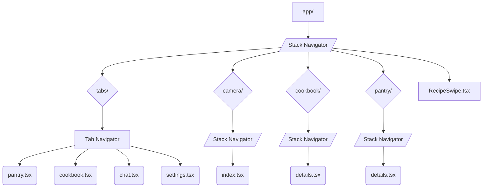

```mermaid
graph TD
    Root[app/] --> StackNavigator[(Stack Navigator)]
    StackNavigator[/Stack Navigator/] --> Tabs{tabs/}

    Tabs --> TabsNavigator[Tab Navigator]
    TabsNavigator --> TabsIndex(pantry.tsx)
    TabsNavigator --> Two(cookbook.tsx)
    TabsNavigator --> Chat(chat.tsx)
    TabsNavigator --> Three(settings.tsx)

    StackNavigator[/Stack Navigator/] --> Camera{camera/}
    Camera --> CameraNavigator[/Stack Navigator/]
    CameraNavigator --> CameraIndex(index.tsx)


    StackNavigator[/Stack Navigator/] --> Cookbook{cookbook/}
    Cookbook --> CookbookNavigator[/Stack Navigator/]
    CookbookNavigator --> CookbookDetails(details.tsx)

    StackNavigator[/Stack Navigator/] --> Pantry{pantry/}
    Pantry --> PantryNavigator[/Stack Navigator/]
    PantryNavigator --> PantryDetails(details.tsx)

    StackNavigator[/Stack Navigator/] --> RecipeSwipe[RecipeSwipe.tsx]


```
